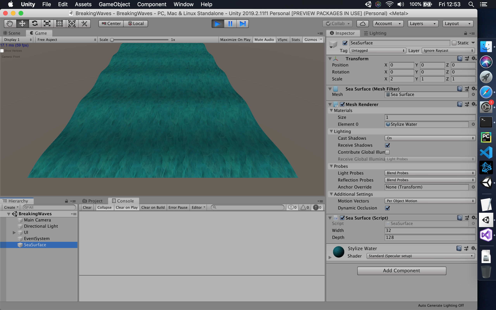

# A simple model of ocean waves

An implementation in [Unity](https://unity.com) of:

> A simple model of ocean waves. Alain Fournier and William T. Reeves. 1986.

In Proceedings of the 13th annual conference on Computer graphics and 
interactive techniques (SIGGRAPH '86),
David C. Evans and Russell J. Athay (Eds.). ACM, New York, NY, USA, 75-84.

DOI http://dx.doi.org/10.1145/15922.15894

## To-Do list

1. [x] Complete Section 3 "Basic Model".
1. [ ] Add changes in Section 4 "Special Effects".
1. [ ] Particle system for foam and spray.
1. [ ] Procedural texturing for surface foam.
1. [ ] Investigate terrain modelling:
    1. [ ] Unity's "Terrain Tools" preview
    1. [ ] Digital Terrain and Elevation Data usage (DTED)
1. [ ] Procedural skybox and atmospheric effects
1. [ ] Surface and terrain lighting, e.g. caustics.
1. [ ] Camera boat/surfer with parametric surface collision. 

## Unity requirements

1. In Package Manager turn on - Advanced -> Show preview packages
1. Install via Package Manager - "Terrain Tools" (preview 2.0.2+)
1. Import from Asset Store - "Terrain Tools Sample Asset Pack"
1. Import from Asset Store - "Yughues Free Nature Materials"
1. Jasper Flick's [Catlike Coding](http://catlikecoding.com/unity/tutorials/) Unity C# scripts

## Unity settings

Terrain tips & tricks | Unity 2019 - Tutorial  
https://www.youtube.com/watch?v=bq_PIBWw5oI
